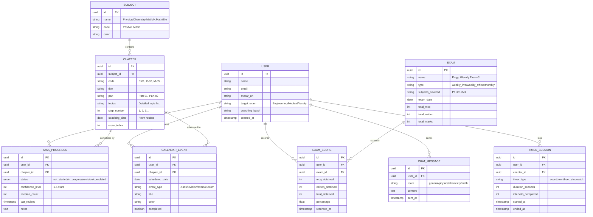

# 📚 StudySync — Admission Study Progress Tracker

## Development Plan

> A full-featured web application for HSC 2026 admission candidates to track coaching progress, manage revision schedules, time study sessions, and collaborate with peers.

---

## 1. Project Overview

### What This App Does
A collaborative study tracking platform built around **your Udvash/Unmesh EAP26 Combo coaching routine**. It lets you:
- Track completion of every chapter (Physics, Chemistry, Math, Higher Math, Biology)
- Drag & drop chapters on a calendar to plan revision sessions
- Time yourself with a general timer AND a **BUET 3-minute interval stopwatch**
- Log coaching exam scores (Weekly, Monthly Revision Tests)
- See your overall routine at a glance
- Chat with other students and view each other's progress

### Target Users
HSC 2026 Engineering/Medical/Varsity admission candidates following the Udvash coaching batch plan.

---

## 2. Tech Stack

| Layer | Technology | Rationale |
|-------|-----------|-----------|
| **Framework** | Next.js 14 (App Router) | SSR, API routes, file-based routing — easy to extend |
| **Language** | TypeScript | Type safety for a complex data model |
| **Styling** | Vanilla CSS + CSS Custom Properties | Full control, no dependency lock-in |
| **Database** | Supabase (PostgreSQL + Auth + Realtime) | Free tier, built-in auth, realtime for chat |
| **State** | React Context + `useReducer` | Lightweight, no external lib needed |
| **Drag & Drop** | `@dnd-kit/core` | Modern, accessible, tree-shakeable |
| **Charts** | Chart.js / Recharts | Progress visualization |
| **Deployment** | Vercel | Zero-config for Next.js |

> [!TIP]
> Supabase gives us **authentication, database, and realtime chat** in one service — drastically reducing backend complexity.

---

## 3. Data Model

### Core Entities



---

## 4. Pre-loaded Coaching Data

The app will come **pre-loaded** with all chapters and exam schedules extracted from your routine PDFs.

### Step-01 Schedule (Aug 17 – Sep 20, 2026)

| Date | Physics | Chemistry | Math | H.Math | Offline Exam |
|------|---------|-----------|------|--------|--------------|
| Aug 19 | P-01 Pt.1: Vector (Resultant, Components) | | | | |
| Aug 20 | P-01 Pt.2: Vector (Dot/Cross Product) | | | | |
| Aug 21 | | C-01 Pt.1: Quantitative Chem (Mole, Stoichiometry) | | | P-01 Exam |
| Aug 22 | | C-01 Pt.2: Quantitative Chem (Oxidation-Reduction) | | | |
| Aug 24 | | | M-01 Pt.1: Straight Line (Coordinate System) | | C-01 Exam |
| Aug 25 | | | M-01 Pt.2: Straight Line (Equations, Image) | | |
| Aug 26 | P-02 Pt.1: Dynamics | | | | M-01 Exam |
| Aug 27 | P-02 Pt.2: Measurement + Projectile | | | | |
| *Aug 27-28* | *Engg. Weekly Exam-01 (P1+C1+M1)* | | | | |
| Aug 28 | | C-02 Pt.1: Chemical Changes (Equilibrium) | | | P-02 Exam |
| ... | *(continues through Sep 20)* | | | | |

### Full Chapter List (Physics — Engineering)

| Code | Chapter | Topics |
|------|---------|--------|
| P-01 | Vector | Parallelogram Law, Components, Dot/Cross Product, Gradient, Curl, River-Boat |
| P-02 | Dynamics + Measurement | Projectile, Physical World & Measurement |
| P-03 | Newtonian Mechanics (Part A) | Newton's Laws, Friction, Momentum, Collision, Moment of Inertia |
| P-04 | Newtonian Mechanics (Part B) | Circular Motion (Horizontal, Vertical, Banking), Work-Energy-Power |
| P-05 | Gravitation + Structural Properties | Kepler's Laws, Gravity, Elasticity, Surface Tension |

### Full Chapter List (Chemistry — Engineering)

| Code | Chapter | Topics |
|------|---------|--------|
| C-01 | Quantitative Chemistry | Mole, Stoichiometry, Oxidation-Reduction, Titration, Beer-Lambert |
| C-02 | Chemical Changes (Kinetics) | Equilibrium, Kp/Kc, Kinetics, Arrhenius, Catalyst |
| C-03 | Chemical Changes (Acid-Base) + Thermo | Acid-Base Equilibrium, Environmental Chemistry, Thermochemistry |
| C-04 | Qualitative Chemistry | Atomic Models, Quantum Numbers, Solubility Product, Chromatography |
| C-05 | Periodic Properties & Bonding | Periodic Table, Ionic/Covalent Bond, Hybridization |

### Full Chapter List (Math — Engineering)

| Code | Chapter | Topics |
|------|---------|--------|
| M-01 | Straight Line | Coordinate System, Equations, Distance, Image |
| M-02 | Circle | Equation Forms, Tangent, Secant, Relative Position, Common Tangents |
| M-03 | Conics | Parabola, Ellipse, Hyperbola, Tangents/Secants |
| M-04 | Real Numbers + Complex Numbers | Inequalities, Powers of i, Modulus, Argument, Polar Form, Locus |
| M-05 | Matrices & Determinants + Polynomials | Matrix Operations, Polynomial Equations |

### Exam Schedule

| Exam | Type | Subjects | Date |
|------|------|----------|------|
| Engg. Weekly-01 | Live (1h30m) | P1+C1+M1 | Aug 27-28 |
| Engg. Weekly-02 | Live | P2+C2+M2 | Sep 03-04 |
| Engg. Weekly-03 | Live | P3+C3+M3 | Sep 10-11 |
| Engg. Weekly-04 | Live | P4+C4+M4 | Sep 17-18 |
| Engg. Monthly-01 | Revision Test (3h, 600 marks written) | P1-4+C1-4+M1-4 | Sep 20-21 |

---

## 5. Features & Pages

### Page Structure

```
/                          → Landing page (login/signup)
/dashboard                 → Main dashboard (overview)
/calendar                  → Calendar view with drag & drop
/chapters                  → All chapters list with progress
/chapters/[subject]        → Subject-wise chapter view
/timer                     → Timer & BUET Stopwatch
/exams                     → Exam scores & analytics
/routine                   → Full coaching routine view
/chat                      → Real-time chatroom
/profile/[userId]          → Public profile with progress
/settings                  → User preferences
```

---

### 5.1 🔐 Authentication

| Feature | Details |
|---------|---------|
| Sign up / Log in | Email + password via Supabase Auth |
| OAuth (optional) | Google login for convenience |
| Profile setup | Name, target exam (Engg/Medical/Varsity), avatar |
| Session persistence | JWT-based, auto-refresh |

---

### 5.2 📊 Dashboard

The main hub after login. Shows at-a-glance progress.

**Components:**
- **Progress Ring** — Overall % of chapters completed (by subject, color-coded)
- **Today's Tasks** — What's scheduled today from the coaching routine
- **Streak Counter** — Consecutive days studied
- **Upcoming Exams** — Next 3 exams with countdown
- **Quick Timer Access** — Start a timer directly
- **Revision Alert** — Chapters that haven't been revised in 7+ days
- **Leaderboard Widget** — Top 5 users by progress %
- **Recent Activity Feed** — Latest chat messages + friend updates

---

### 5.3 📅 Calendar View (Drag & Drop)

> [!IMPORTANT]
> This is the core scheduling feature. Users can visualize AND reschedule their study plan.

**Features:**
- **Monthly/Weekly/Daily views** — Toggle between views
- **Pre-populated** with coaching routine dates (from the PDF)
- **Drag & drop chapters** to reschedule revision sessions
- **Color coding** by subject (Physics=Blue, Chemistry=Green, Math=Orange, H.Math=Purple, Bio=Red)
- **Event types** distinguished by icons:
  - 📖 Class (from coaching routine)
  - 🔄 Revision (user-scheduled)
  - 📝 Exam
  - ✏️ Custom event
- **Click to expand** — Shows chapter topics, notes, confidence level
- **"Add Revision" button** — Quick-add a chapter revision to any date
- **Conflict warnings** — If too many tasks on one day

**Implementation:**
- `@dnd-kit/core` for drag-and-drop
- CSS Grid for calendar layout
- `date-fns` for date manipulation

---

### 5.4 ✅ Chapter Tracker

**List View:**
- All chapters grouped by subject, expandable
- Each chapter shows:
  - Status badge: `Not Started` → `In Progress` → `Revision` → `Completed`
  - Confidence rating (1-5 stars)
  - Revision count & last revised date
  - Topics covered (expandable)
  - Personal notes field
- **Filter & Sort**: By subject, status, confidence, date
- **Search**: Find any chapter instantly
- **Bulk actions**: Mark multiple as completed

**Card View (Alternative):**
- Kanban-style board: Not Started | In Progress | Revision | Done
- Drag chapters between columns

---

### 5.5 ⏱️ Timer System

Two distinct timer modes:

#### A. General Countdown Timer
- Set custom duration (e.g., 45 min, 1 hour, 2 hours)
- Preset buttons: 25min (Pomodoro), 45min, 1hr, 2hr
- **Link to chapter** — Associate timer session with a specific chapter
- Pause/Resume/Reset controls
- Audio alert on completion
- Auto-logs session duration to `TIMER_SESSION` table
- **Break timer** — Optional 5/10 min break after session

#### B. BUET 3-Minute Interval Stopwatch
> [!NOTE]
> BUET admission MCQ exam gives ~3 minutes per question. This stopwatch helps practice that pacing.

- **Counts UP** in 3-minute intervals
- Visual display: `Interval #5 | 02:17 / 03:00`
- **Color shift**: Green (0-2min) → Yellow (2-2:30min) → Red (2:30-3min)
- **Beep/vibration** at each 3-minute mark
- Running total of intervals completed
- **Stats at end**: Average time per interval, total time, intervals completed
- Optional: Record which questions were answered per interval
- Fullscreen mode for distraction-free practice

**Shared Timer UI:**
- Large, centered digital display with smooth CSS animations
- Floating timer option (small overlay while browsing other pages)
- Session history log

---

### 5.6 📝 Exam Score Tracker

**Features:**
- **Pre-loaded exam list** matching the coaching schedule
- For each exam, input:
  - MCQ marks obtained (out of total)
  - Written marks obtained (out of total)
  - Auto-calculates percentage
- **Analytics Dashboard:**
  - Line chart: Score trends over time (per subject)
  - Bar chart: Subject-wise average comparison
  - Radar chart: Strengths vs weaknesses across subjects
  - Performance vs class average (if others share scores)
- **Exam format reference:**
  - Daily Class Exam: 15 MCQ + 10 Written (15 min)
  - Weekly Live Exam: MCQ (120) + Written (180) = 300 marks (1h30m)
  - Monthly Revision Test: Written only (600 marks, 3h)
  - Offline Exam: 20 MCQ + 10 Written

---

### 5.7 📋 Overall Routine View

A read-only, beautifully formatted view of the complete coaching routine.

**Features:**
- **Step-by-step breakdown** (Step-01: Aug 17 – Sep 20, and future steps)
- **Timeline view** — Vertical timeline with dates, classes, and exams
- **Subject filters** — Show/hide subjects
- **Today indicator** — Highlights current position in the routine
- **Progress overlay** — Shows completion status on each item
- **Printable version** — CSS `@media print` optimized
- **Sync status** — "You are 2 days ahead / 1 day behind schedule"

---

### 5.8 💬 Chat Room

**Features:**
- **Rooms:**
  - `#general` — Open discussion
  - `#physics` / `#chemistry` / `#math` — Subject-specific help
  - `#exam-discussion` — Post-exam talk
- **Real-time messaging** via Supabase Realtime
- Markdown support for sharing equations/formulas
- User avatars and timestamps
- Online user indicator
- Message reactions (👍, 🔥, 💡)
- **No file uploads** (keeps it simple for v1)

---

### 5.9 👤 User Profiles

**Public Profile:**
- Name, avatar, target exam
- **Progress overview:** Subject-wise completion % (ring charts)
- **Exam scores** (if user opts to share)
- **Study streak** count
- **Recent activity** timeline
- **Total study hours** (from timer sessions)

**Privacy:**
- Users can toggle visibility of:
  - Exam scores
  - Chapter progress details
  - Study hours

---

### 5.10 ⚙️ Settings

- Edit profile (name, avatar, target exam)
- Notification preferences (exam reminders, revision alerts)
- Theme toggle (Dark/Light mode)
- Privacy controls
- Data export (JSON/CSV)
- Account deletion

---

## 6. Additional Features

### 6.1 🔄 Smart Revision System
- Uses **spaced repetition** logic
- After completing a chapter, auto-suggests revision dates (1 day, 3 days, 7 days, 14 days)
- Adds suggested revisions to calendar
- Dashboard alert for overdue revisions

### 6.2 📈 Analytics & Insights
- **Weekly report** — Summary of study hours, chapters covered, exam scores
- **Heatmap** — GitHub-style activity heatmap showing study days
- **Subject balance** — Pie chart showing time distribution across subjects
- **Prediction** — "At your current pace, you'll finish Step-01 by [date]"

### 6.3 🏆 Gamification
- **XP system** — Earn XP for completing chapters, taking exams, maintaining streaks
- **Badges** — "Physics Master", "7-Day Streak", "First Monthly Test"
- **Leaderboard** — Ranked by XP, with filters (weekly/all-time)

### 6.4 📱 Progressive Web App (PWA)
- Installable on mobile
- Offline support for viewing schedule
- Push notifications for exam reminders

---

## 7. Design System

### Color Palette

```css
:root {
  /* Background */
  --bg-primary: #0a0a0f;
  --bg-secondary: #12121a;
  --bg-card: #1a1a2e;
  --bg-hover: #22223a;
  
  /* Subject Colors */
  --physics: #4f8cff;
  --chemistry: #34d399;
  --math: #f59e0b;
  --higher-math: #a78bfa;
  --biology: #f87171;
  
  /* Accent */
  --accent-primary: #6366f1;
  --accent-glow: rgba(99, 102, 241, 0.3);
  
  /* Text */
  --text-primary: #f1f5f9;
  --text-secondary: #94a3b8;
  --text-muted: #64748b;
  
  /* Status */
  --status-not-started: #64748b;
  --status-in-progress: #f59e0b;
  --status-revision: #a78bfa;
  --status-completed: #34d399;
}
```

### Typography
- **Primary font**: `Inter` (Google Fonts)
- **Monospace** (timer): `JetBrains Mono`
- **Headings**: Bold, tracking-tight

### Design Principles
- **Dark mode first** — Easier on eyes during long study sessions
- **Glassmorphism** — Frosted glass cards with backdrop-blur
- **Micro-animations** — Smooth transitions on all interactive elements
- **Subject color accents** — Consistent color language throughout
- **Responsive** — Mobile-first, works on phone during breaks

---

## 8. Implementation Phases

### Phase 1: Foundation (Days 1–3)
- [x] Project setup (Next.js + TypeScript + Supabase)
- [ ] Design system (CSS variables, global styles, components)
- [ ] Database schema + seed data (all chapters from PDF)
- [ ] Authentication (signup, login, profile setup)
- [ ] Basic layout (sidebar navigation, responsive shell)

### Phase 2: Core Features (Days 4–8)
- [ ] Chapter tracker (list view, status updates, confidence rating)
- [ ] Calendar view (monthly grid, pre-populated events)
- [ ] Drag & drop for calendar events
- [ ] General countdown timer
- [ ] BUET 3-minute interval stopwatch
- [ ] Overall routine view

### Phase 3: Social & Scoring (Days 9–12)
- [ ] Exam score tracker (input + analytics charts)
- [ ] Chat room (Supabase Realtime)
- [ ] User profiles (public progress view)
- [ ] Leaderboard

### Phase 4: Polish (Days 13–15)
- [ ] Smart revision suggestions
- [ ] Analytics dashboard & heatmap
- [ ] Gamification (XP, badges)
- [ ] PWA setup (manifest, service worker)
- [ ] Performance optimization
- [ ] Testing & bug fixes

---

## 9. File Structure

```
study-sync/
├── public/
│   ├── manifest.json
│   ├── icons/
│   └── sounds/
│       ├── timer-end.mp3
│       └── interval-beep.mp3
├── src/
│   ├── app/
│   │   ├── layout.tsx              # Root layout (sidebar, theme)
│   │   ├── page.tsx                # Landing / Login
│   │   ├── dashboard/
│   │   │   └── page.tsx
│   │   ├── calendar/
│   │   │   └── page.tsx
│   │   ├── chapters/
│   │   │   ├── page.tsx            # All chapters
│   │   │   └── [subject]/
│   │   │       └── page.tsx
│   │   ├── timer/
│   │   │   └── page.tsx
│   │   ├── exams/
│   │   │   └── page.tsx
│   │   ├── routine/
│   │   │   └── page.tsx
│   │   ├── chat/
│   │   │   └── page.tsx
│   │   ├── profile/
│   │   │   └── [userId]/
│   │   │       └── page.tsx
│   │   ├── settings/
│   │   │   └── page.tsx
│   │   └── api/
│   │       ├── chapters/
│   │       ├── progress/
│   │       ├── exams/
│   │       ├── timer/
│   │       └── chat/
│   ├── components/
│   │   ├── ui/                     # Reusable primitives
│   │   │   ├── Button.tsx
│   │   │   ├── Card.tsx
│   │   │   ├── Badge.tsx
│   │   │   ├── Modal.tsx
│   │   │   ├── ProgressRing.tsx
│   │   │   ├── StarRating.tsx
│   │   │   └── ...
│   │   ├── layout/
│   │   │   ├── Sidebar.tsx
│   │   │   ├── Header.tsx
│   │   │   └── MobileNav.tsx
│   │   ├── calendar/
│   │   │   ├── CalendarGrid.tsx
│   │   │   ├── CalendarEvent.tsx
│   │   │   └── DraggableChapter.tsx
│   │   ├── timer/
│   │   │   ├── CountdownTimer.tsx
│   │   │   ├── BuetStopwatch.tsx
│   │   │   └── TimerDisplay.tsx
│   │   ├── chapters/
│   │   │   ├── ChapterCard.tsx
│   │   │   ├── ChapterList.tsx
│   │   │   └── SubjectFilter.tsx
│   │   ├── exams/
│   │   │   ├── ScoreInput.tsx
│   │   │   ├── ScoreChart.tsx
│   │   │   └── ExamCard.tsx
│   │   ├── chat/
│   │   │   ├── ChatRoom.tsx
│   │   │   ├── MessageBubble.tsx
│   │   │   └── RoomSelector.tsx
│   │   └── profile/
│   │       ├── ProfileCard.tsx
│   │       └── ProgressOverview.tsx
│   ├── lib/
│   │   ├── supabase/
│   │   │   ├── client.ts
│   │   │   ├── server.ts
│   │   │   └── middleware.ts
│   │   ├── utils.ts
│   │   └── constants.ts
│   ├── data/
│   │   ├── chapters.ts              # All chapter data (from PDFs)
│   │   ├── exams.ts                 # All exam schedule data
│   │   └── routine.ts               # Full routine timeline
│   ├── hooks/
│   │   ├── useTimer.ts
│   │   ├── useBuetStopwatch.ts
│   │   ├── useCalendarDnd.ts
│   │   ├── useProgress.ts
│   │   └── useAuth.ts
│   ├── context/
│   │   ├── AuthContext.tsx
│   │   ├── ThemeContext.tsx
│   │   └── TimerContext.tsx
│   ├── types/
│   │   └── index.ts                 # All TypeScript interfaces
│   └── styles/
│       ├── globals.css              # Design system + reset
│       ├── calendar.css
│       ├── timer.css
│       ├── chat.css
│       └── components.css
├── supabase/
│   ├── migrations/
│   │   └── 001_initial_schema.sql
│   └── seed.sql                     # Pre-loaded chapters & exams
├── next.config.js
├── tsconfig.json
├── package.json
└── README.md
```

---

## 10. Extensibility Design

> [!IMPORTANT]
> The architecture is designed for easy future modifications.

| What you might want to change | How it's easy to do |
|-------------------------------|---------------------|
| **Add Step-02, Step-03 chapters** | Add entries to `data/chapters.ts` — the UI auto-populates |
| **New subject** | Add to `SUBJECT` table + assign a color in CSS variables |
| **New exam type** | Add to `EXAM` table — score input component adapts |
| **New chat rooms** | Just add a room string — no code change needed |
| **New timer mode** | Create a new hook in `hooks/` + component in `timer/` |
| **Theme changes** | Modify CSS custom properties in `globals.css` |
| **New page/feature** | Add a folder under `app/` — Next.js routing handles it |
| **Mobile app** | Already a PWA — installable on any device |
| **Localization (Bangla UI)** | Add `i18n` config + translation files — component text stays in one place |

---

## 11. Key Dependencies

```json
{
  "dependencies": {
    "next": "^14.0.0",
    "react": "^18.0.0",
    "@supabase/supabase-js": "^2.0.0",
    "@supabase/auth-helpers-nextjs": "^0.8.0",
    "@dnd-kit/core": "^6.0.0",
    "@dnd-kit/sortable": "^8.0.0",
    "date-fns": "^3.0.0",
    "recharts": "^2.0.0",
    "react-hot-toast": "^2.0.0"
  }
}
```

---

## 12. Open Questions for You

> [!WARNING]
> Please answer these before we start building — they affect the architecture.

1. **Which exam track are you on?** Engineering only, or also Medical/Varsity KA?
   - This determines which chapters and exams to show by default.

2. **Do you want Higher Math chapters pre-loaded?**
   - The BVP (Bangla) PDF had Higher Math (Integration, Differential Equations, Complex Numbers, etc.). Should we include those?

3. **Should exam scores be public by default or private?**
   - We can make it toggleable, but what's the default?

4. **Do you want the chat to support LaTeX/math equations?**
   - Useful for sharing solutions, but adds complexity.

5. **Supabase project — do you already have one, or should I set it up from scratch?**
   - We'll need the project URL and anon key.

6. **Should we start with a simpler local-storage version first** (no backend, single user) and add Supabase later? This would let you start using it immediately.

---

> **Next Step:** Once you confirm the plan and answer the open questions, I'll start building Phase 1 immediately.
